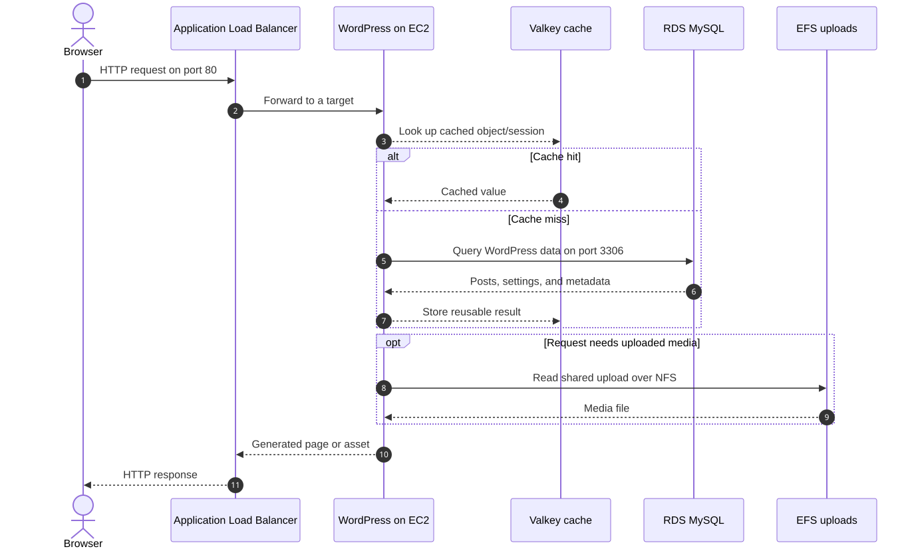

# Scalable WordPress on AWS

A production-style WordPress architecture built with Terraform. This project replaces the usual single public server with a multi-tier AWS design that can scale horizontally while keeping application and data services off the public internet.

It demonstrates practical infrastructure engineering: network isolation, least-privilege access, automated bootstrapping, shared state, load balancing, autoscaling, managed secrets, TLS, and explicit cost/availability trade-offs.

[](diagrams/request-flow.mmd)

_Select the diagram to view the Mermaid source._

## What this project demonstrates

| Engineering concern | Implementation |
| --- | --- |
| High availability | Resources span two Availability Zones, with an ALB distributing requests across an Auto Scaling group. |
| Network security | Only the ALB is public. EC2 runs without public IP addresses, and RDS is not publicly accessible. |
| Horizontal scaling | Target-tracking scaling adjusts EC2 capacity around 60% average CPU utilization. |
| Shared application state | EFS stores WordPress uploads so every EC2 instance sees the same media files. |
| Managed data services | RDS provides MySQL and ElastiCache Serverless provides a Valkey-compatible object cache. |
| Secrets management | RDS generates its password in Secrets Manager; EC2 retrieves it with a narrowly scoped IAM role. |
| Administrative access | Systems Manager Session Manager replaces SSH keys, public IPs, and inbound port 22. |
| Repeatable provisioning | EC2 user data installs and configures Nginx, PHP-FPM, WP-CLI, WordPress, EFS, and Redis caching. |
| HTTPS support | An optional custom domain enables ACM certificate validation and HTTP-to-HTTPS redirects. |

## Architecture

The VPC uses three network tiers across two Availability Zones. The defaults
are `us-east-1a` and `us-east-1b`; callers can provide `availability_zones`
when they need different placement:

1. **Public subnets** contain the internet-facing Application Load Balancer and one NAT gateway per Availability Zone.
2. **Private application subnets** contain WordPress EC2 instances, EFS mount targets, and Valkey. Instances can download updates through NAT but cannot receive connections directly from the internet.
3. **Isolated database subnets** contain RDS and have no route to the internet.

Traffic follows this path:

```text
Internet → Application Load Balancer → private EC2 instances
                                           ├── RDS MySQL
                                           ├── EFS uploads
                                           └── Valkey object cache
```

Security groups authorize traffic by source security group rather than broad internal CIDR ranges: the ALB can reach WordPress, and only WordPress can reach MySQL, EFS, and Valkey.

For a deeper explanation, see the [networking walkthrough](docs/public-private-networking.md) and [editable Mermaid diagram](diagrams/request-flow.mmd).

## Deploy

### Prerequisites

Before deploying, you need:

- Terraform installed locally
- AWS credentials with permission to create the resources in this repository
- A DNS name you control if you want HTTPS with a custom domain

The default AMI is `ami-0bdc7d025135d7b49`. Set `ami_id` to use another image.

> **Cost warning:** this stack creates billable AWS resources, including two NAT gateways, an Application Load Balancer, RDS, EFS, EC2, and ElastiCache. Review the [estimated cost](#estimated-cost) before applying, and run `terraform destroy` when finished.

<details>
<summary><strong>Deploy without a custom domain</strong></summary>

#### Step 1: Initialize Terraform

```bash
terraform init
```

#### Step 2: Review the execution plan

```bash
terraform plan
```

#### Step 3: Deploy the stack

```bash
terraform apply
```

#### Step 4: Open WordPress

```bash
terraform output -raw url
```

Open the printed load-balancer URL to complete the WordPress setup.

</details>

<details>
<summary><strong>Deploy with a custom domain and HTTPS</strong></summary>

#### Step 1: Initialize Terraform

```bash
terraform init
```

#### Step 2: Configure the domain

Create `terraform.tfvars` with the hostname that will serve WordPress:

```hcl
domain_name = "wordpress.example.com"
```

#### Step 3: Request the certificate

```bash
terraform apply -target=aws_acm_certificate.cert
```

Terraform prints a DNS tutorial with the exact CNAME type, name, and target to use.

#### Step 4: Validate the certificate

Follow the printed tutorial to create the CNAME at your DNS provider, then wait for the record to propagate. You can display the instructions again at any time:

```bash
terraform output -raw certificate_validation_tutorial
```

#### Step 5: Review and deploy the complete stack

```bash
terraform apply
```

Terraform waits for ACM validation, configures HTTPS, and redirects HTTP requests to the secure URL.

#### Step 6: Point the subdomain to the load balancer

The ACM validation CNAME proves that you control the domain, but it does not send traffic to WordPress. Create a second DNS record using the values printed in `domain_routing_tutorial`:

```text
Type:   CNAME
Name:   wordpress.example.com
Target: <the value of load_balancer_dns_name>
```

Some DNS providers expect only the host label, such as `wordpress`, in the Name field and append the parent domain automatically.

Display the exact instructions again with:

```bash
terraform output -raw domain_routing_tutorial
```

Keep the ACM validation CNAME in place so AWS can renew the certificate automatically.

#### Step 7: Open WordPress

```bash
terraform output -raw url
```

</details>

## Repository guide

| Path | Purpose |
| --- | --- |
| `network.tf` | VPC, six subnets, internet gateway, NAT gateways, and route tables |
| `security-groups.tf` | Service-to-service network boundaries |
| `load-balancer.tf` | ALB, health checks, ACM certificate, HTTPS listener, and redirect |
| `compute.tf` | Launch template, Auto Scaling group, and CPU target tracking |
| `database.tf` | Private RDS MySQL instance with an AWS-managed password |
| `storage.tf` | Shared EFS filesystem and mount targets |
| `cache.tf` | ElastiCache Serverless for Valkey |
| `iam.tf` | Least-privilege EC2 access to the database secret |
| `providers.tf` | Terraform/provider constraints and AWS Region configuration |
| `scripts/bootstrap-wordpress.sh.tftpl` | Automated WordPress, Nginx, PHP, EFS, and cache configuration |
| `docs/` and `diagrams/` | Architecture explanations and diagram source |

## Connect without SSH

The instances have no public IP address, SSH key pair, or inbound SSH rule.
After deployment, select an instance in the EC2 console and choose
**Connect → Session Manager**, or start a session with the AWS CLI:

```bash
aws ssm start-session --target <instance-id> --region <aws-region>
```

The instance role includes `AmazonSSMManagedInstanceCore`, and private
instances reach the Systems Manager service through their Availability Zone's
NAT gateway.

## Design decisions and trade-offs

- **One NAT gateway per Availability Zone** avoids a cross-zone dependency for private workloads, but it is the largest fixed cost. A development variant could use one NAT gateway at the cost of lower resilience.
- **EFS for uploads** makes EC2 instances replaceable and supports horizontal scaling, though it costs more and has different latency characteristics than local disk.
- **AWS-managed database credentials** keep the password out of Terraform configuration and state inputs. The instance role can read only that specific secret.
- **Conditional TLS** keeps the project deployable without a domain while supporting ACM-managed certificates and HTTPS redirects when a domain is provided.
- **User-data bootstrapping** makes the example self-contained. A larger production platform could build immutable images with Packer to shorten instance startup time.

## Estimated cost

Expect roughly **$130–$150 per month** for a small, continuously running deployment in `us-east-1`, before meaningful traffic or free-tier credits. This assumes one `t3.micro` EC2 instance, a Single-AZ `db.t3.micro` RDS database with 20 GB of storage, light EFS and Valkey usage, and 730 hours per month.

| Service | Approximate monthly cost |
| --- | ---: |
| Two NAT gateways | $66 |
| Application Load Balancer and light LCU usage | $17–$23 |
| EC2 `t3.micro` | $8 |
| RDS `db.t3.micro` and 20 GB storage | $15–$22 |
| ElastiCache Serverless for Valkey | From $6 |
| Public IPv4 addresses | About $15 |
| EFS, Secrets Manager, and small variable charges | $1–$5 |
| **Estimated total** | **$130–$150/month** |

Data transfer, NAT processing, ALB capacity, cache requests, EFS usage, backups, and CPU credits can increase the total. Prices change, so confirm the estimate with the [AWS Pricing Calculator](https://calculator.aws/) before deploying.

## Clean up

Avoid ongoing AWS charges when you are finished:

```bash
terraform destroy
```
